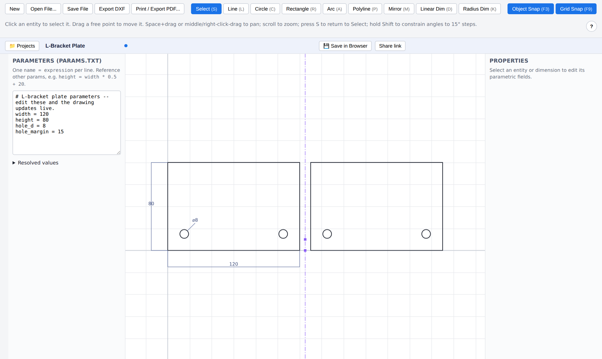
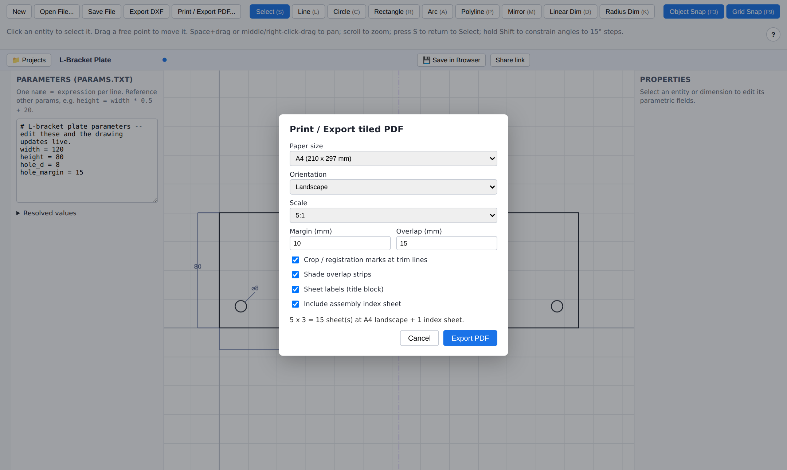

# Parametric CAD

[](https://github.com/prohfesor/symmetrical-waffle/actions/workflows/ci.yml)
[](LICENSE)

A 2D CAD drawing tool where **every dimension is a formula** in a plain text
file. Draw geometry, bind any length, radius or angle to named parameters,
mirror it, export to **DXF**, and print at any scale tiled across real paper
(A4, A3, custom...) with overlap, crop marks and an assembly index -- like
KOMPAS's print-split composer. Runs as a desktop app, in the browser, or as a
static site on GitHub Pages.



Change `width = 120` in the parameters panel and the plate, its holes, the
mirror image and the dimensions all follow.

| Parametric drawing                                                                                                            | Tiled printing                                                                                               |
| ----------------------------------------------------------------------------------------------------------------------------- | ------------------------------------------------------------------------------------------------------------ |
| Entities take numbers or formulas (`=width / 2 + 3`), anchor to each other's points, and mirror across a formula-driven axis. | Pick paper, orientation, scale and overlap; get a multi-page PDF with registration marks and an index sheet. |

<p align="center"></p>

## Quick start

Requires Node.js 22.5 or newer.

```sh
npm install
npm run dev:ui        # the app in your browser, http://localhost:5173
npm run dev:desktop   # or as a desktop window (Electron)
```

Everything works offline with local files. Accounts and cloud sharing need the
server (`npm run dev:web`), and a no-server build for GitHub Pages is described
under [Static hosting](#static-hosting-github-pages).

## How it works

- **Params file** (`name = expression`, one per line, plain text) defines
  named variables. Expressions can reference other variables and use standard
  math functions -- see [Params file format](#params-file-format).
- **Geometry** (lines, circles, arcs, polylines, rectangles) is drawn on a
  canvas. Any numeric field on an entity -- a line's length, a circle's
  radius, a rectangle's width -- can be a literal number or a formula
  (`=width / 2 + 3`) referencing the params file. Edit the params file and
  every bound entity recomputes immediately.
- **Entities can anchor to each other's points** (e.g. a hole's center
  anchored to a plate corner) so connected shapes stay connected as
  parameters change.
- **Mirror** (`M`) reflects any entities across an axis through two points.
  The copies are computed, not stored, so they follow the originals and the
  axis: put the axis at `=width / 2` and the mirror image tracks your
  parameters. Copies can be anchored to and dimensioned like any entity, and
  mirrors can be stacked (mirror a mirror) for symmetry across two axes.
- **Dimensions** (linear, radius, diameter, angular) are visual annotations
  bound to an entity's resolved value, so the number shown on the drawing is
  always the live computed value.
- **Export**: DXF (R12 ASCII, broadly compatible with any CAD package) and a
  tiled, scaled PDF for printing on real paper.
- **Accounts**: sign in with Google, save drawings to your account, and mark
  each drawing private or public. Public drawings get a shareable link anyone
  can open read-only (view/tweak locally) without signing in.

### Why not a full geometric constraint solver?

Tools like FreeCAD's Sketcher or SolveSpace solve an arbitrary system of
constraints (parallel, tangent, coincident, ...) simultaneously with a
nonlinear solver. This project intentionally does **not** do that. Instead,
each entity stores its own local parametric definition (start point + length

- angle, center + radius, ...), and entities connect to each other only by
  anchoring a point directly to another entity's named point. This is simpler
  and more predictable to implement and reason about, at the cost of not
  supporting arbitrary constraint graphs (no "make these two lines parallel"
  constraint, for instance). A full constraint solver is a reasonable future
  enhancement but is a substantially larger undertaking.

## Project layout

This is an npm workspaces monorepo:

- **`packages/core`** -- platform-agnostic TypeScript library: the expression
  engine, params file parser, parametric geometry model/resolver, DXF writer,
  and the print-tiling + PDF export engine. No DOM or Node-specific
  dependencies (aside from `pdf-lib`, which runs in both). Has the full unit
  test suite.
- **`packages/ui`** -- the React + Canvas2D drawing application. The same UI
  runs as a plain web app (Vite, talking to `packages/server`) and inside the
  desktop shell -- one implementation, two shells.
- **`packages/desktop`** -- a thin Electron shell around `packages/ui`. Adds
  native OS file dialogs (open/save) and a native File menu; everything else
  is the same web UI running in Chromium. Local-file save/open works fully
  offline, with no account needed.
- **`packages/server`** -- Express API: Google OAuth login (via Passport,
  session cookies), and a small REST API for saving/listing/loading drawings
  per account with a private/public visibility flag. Uses Node's built-in
  `node:sqlite` (no native module compilation, no external database to run).
  In production it also serves the built `packages/ui` bundle itself, so the
  whole web app is one deployable process.

Desktop, web, and account-saved drawings all read and write the exact same
project format (see below) -- a project started on desktop opens on web and
vice versa, and a cloud-saved drawing is just that same JSON stored server-side
instead of on disk.

## Running it

Install once at the repo root (installs all workspaces):

```sh
npm install
```

### Desktop app (recommended)

```sh
npm run dev:desktop
```

This builds the Electron main/preload scripts, starts the Vite dev server for
the UI, waits for it, and launches the Electron window pointed at it (hot
reload works for the UI and for `packages/core`, which the UI imports from
source).

For a production-style run (no dev server, loads the built UI bundle):

```sh
npm run build
npm run start --workspace=@pcad/desktop
```

The desktop window runs sandboxed, can't navigate away from the app, and asks
before closing if there are unsaved changes.

### Web app, with accounts

```sh
npm run dev:web    # runs @pcad/server and @pcad/ui together
```

Open http://localhost:5173. Native file dialogs aren't available in a plain
browser, so local Save/Open/Export fall back to browser downloads and a file
picker -- same file formats, just a different transport. Sign-in, cloud save,
and sharing need `@pcad/server` running (see below); without it the app still
works fully offline using local files, it just shows "Sign in" as
unreachable.

If you only want the UI with no backend at all: `npm run dev:ui` on its own.

## Accounts, cloud save, and sharing

- **Sign in** (top bar) authenticates via Google OAuth against
  `@pcad/server`. Without real Google credentials configured, the server
  falls back to a **dev-only stub login** (just an email/name
  form, no password) on localhost so the whole flow is testable without setting up OAuth
  first -- see `packages/server/.env.example` for how to add real credentials
  later, and the [Deploying for real](#deploying-for-real) section for the
  Google Cloud Console steps.
- **Save to Cloud** persists the current document + params text to your
  account (`@pcad/server`'s SQLite database). **My Drawings** lists and
  reopens your saved drawings.
- Every cloud drawing has a **Private/Public** visibility toggle. Public
  drawings get a **Copy share link** (`#/d/<id>`); opening that link loads
  the drawing read-only-ish for anyone -- no sign-in required -- and their
  local edits save as _their own new copy_ rather than overwriting yours.
- This is additive to, not a replacement for, local file save/open/export --
  those keep working with no account at all.

### Tests and checks

```sh
npm run check          # typecheck + unit/integration tests + build, all workspaces
npm test               # just the tests
npm run test:e2e       # browser smoke test; needs `npm run build` first
npm run test:e2e:pages # same for the static build; needs `npm run build:pages` first
```

- `@pcad/core` -- unit tests for the expression engine, params, geometry
  resolver, DXF writer and print/PDF engine.
- `@pcad/server` -- integration tests that boot the real app on an ephemeral
  port against an in-memory SQLite database (sign-in, cookies,
  ownership/visibility rules, validation, restart persistence).
- `@pcad/ui` -- unit tests for the editor logic that doesn't need a browser:
  state reducer, tool state machine, snapping, hit-testing, file validation.
- `e2e/smoke.mjs` -- boots the built server and drives the real UI in
  Chromium: drawing, shortcuts, unsaved-changes prompts, sign-in, cloud save,
  sharing, and tiled PDF export. (Set `CHROMIUM_PATH` to use a specific
  browser binary.) CI runs all of this plus a Docker build.

## Static hosting (GitHub Pages)

The UI also builds as a plain static site with **no server at all** -- this is
what the `Deploy to GitHub Pages` workflow publishes
(`https://<user>.github.io/<repo>/`). In this flavour:

- there are no accounts or sign-in; **Save in Browser** keeps projects in the
  browser's IndexedDB (the Projects panel lists them), and **Save File** /
  **Open File** back them up as `.pcad.json`
- unsaved work is **autosaved** and comes back after a reload or crash
- **Share link** copies a URL that contains the (compressed) drawing itself
  after the `#`, so it works without a server and the data never goes over the
  network; whoever opens it gets their own copy
- DXF export and tiled PDF printing are unchanged (they were always client-side)

One-time setup: in the repo's _Settings > Pages_, set _Source_ to **GitHub
Actions**, then push to `main`. To try it locally: `npm run build:pages`, then
serve `packages/ui/dist-pages`.

Notes: projects live only in one browser on one device (back up with Save
File), and all of a user's `*.github.io` project sites share one browser origin,
so they share its storage. The normal build also falls back to this mode by
itself when it can't reach a server.

Storage sits behind one interface (`ProjectStore` in
`packages/ui/src/io/projectStore.ts`): _browser_ and _server account_ are two
implementations, and a hosted backend such as Supabase or Firebase for
accounts and private/public sharing on a static site would be a third.

## Deploying for real

A `Dockerfile` at the repo root builds `@pcad/core` + `@pcad/ui` +
`@pcad/server` into one image that serves the whole app (API + static UI) from
a single process on port 8787 -- point any container host (Render, Railway,
Fly.io, Google Cloud Run, a VPS with Docker) at this repo and it should run.
(The Electron desktop package is skipped in this image via
`ELECTRON_SKIP_BINARY_DOWNLOAD=1` -- it isn't needed for the web deployment.)

```sh
docker build -t parametric-cad .
docker run -p 8787:8787 -v pcad-data:/data --env-file packages/server/.env parametric-cad
```

Or without Docker, on any host with Node 22+:

```sh
npm run start:web   # builds everything, then runs @pcad/server (which serves the built ui)
```

Either way, before it's usable for real you need to set (see
`packages/server/.env.example`):

1. **`PUBLIC_SERVER_URL`** -- your real deployed URL (e.g.
   `https://cad.example.com`). The server also serves the UI, so this is the
   only origin involved. Session cookies are marked `Secure` automatically
   when this is an `https://` URL (and only then, so
   `docker run -p 8787:8787 ...` over plain http keeps working). If you map the
   container to a different host port (e.g. `-p 3000:8787`), set
   `PUBLIC_SERVER_URL=http://localhost:3000`. `FRONTEND_URL` only matters in
   the split dev setup (`npm run dev:web`), where it is set for you.
2. **`GOOGLE_CLIENT_ID`** / **`GOOGLE_CLIENT_SECRET`** -- for real Google
   sign-in. In the
   [Google Cloud Console](https://console.cloud.google.com/apis/credentials):
   create an OAuth client ID (Web application), and add
   `<PUBLIC_SERVER_URL>/api/auth/google/callback` as an authorized redirect
   URI. With these set, the dev-login stub is never used.
3. **Persist the database.** The image keeps it at `/data/pcad.sqlite`
   (`DB_PATH`), so mount a volume at `/data` (as above). Outside Docker the
   default is `packages/server/data/pcad.sqlite`. It holds accounts, drawings,
   sessions and the generated session-signing secret, so people stay signed in
   across restarts. `SESSION_SECRET` is optional: set it only if you run
   several instances against shared storage.

**Sign-in modes.** With Google credentials the server uses Google. Without
them it uses the dev-only stub login (email + name, no password) in
development and when `PUBLIC_SERVER_URL` is a loopback address (local Docker).
On a real (non-loopback) production URL with no credentials, sign-in is
_disabled_ rather than silently open; set `ALLOW_DEV_LOGIN=true` to override
that for a private demo.

Nothing in this repo can reach an actual public hosting provider on your
behalf -- it needs credentials/access to one that only you can provide.

## File formats

### Params file (`.params.txt`)

Plain text, one parameter per line:

```
# comments start with '#'
width = 120
height = 80
hole_d = 8
hole_margin = 15
diagonal = sqrt(width^2 + height^2)
```

- Order doesn't matter -- parameters are resolved via a dependency graph, so
  you can reference a variable defined further down the file.
- Circular references and undefined-variable references are reported as
  issues (shown in the app's Parameters panel) rather than crashing.
- Supported operators: `+ - * / % ^` (power is right-associative and binds
  tighter than unary minus, e.g. `-2^2 = -4`).
- Built-in functions: `sin cos tan asin acos atan atan2` (degrees --
  `_rad`-suffixed variants take radians), `sqrt abs floor ceil round min max
pow hypot ln log10 exp sign`, and constants `pi`, `e`.

### Project file (`.pcad.json`)

A single JSON file bundling the drawing document and the params text
together, for convenient save/open as one unit:

```json
{
  "formatVersion": 1,
  "document": { "...": "entities, dimensions, layers" },
  "paramsText": "width = 120\nheight = 80\n..."
}
```

The `paramsText` field is exactly the params file format above, stored
verbatim -- nothing is lost by bundling it, and the Parameters panel in the
app is editing that same text.

### DXF export

Hand-rolled DXF R12 (AC1009) ASCII writer -- deliberately the older/simpler
DXF flavor rather than a newer one, because it has no handle/owner
cross-reference graph or CLASSES/OBJECTS/BLOCK_RECORD machinery, and is the
lowest-common-denominator format essentially every CAD package (KOMPAS,
AutoCAD, LibreCAD, QCAD, Fusion 360, Inkscape, FreeCAD, ...) reads reliably.
Geometry goes on a `GEOMETRY` layer as `LINE`/`CIRCLE`/`ARC`/`POLYLINE`
entities; dimensions are exported as plain exploded geometry + `TEXT` on a
`DIMENSIONS` layer (not native DXF `DIMENSION` entities, which need an
associated dimension-style block to render correctly everywhere -- the
exploded form displays identically in any DXF viewer).

### Print / tiled PDF export

Given a paper size (standard preset or custom), orientation, print scale,
margin, and overlap, the tiling engine computes a grid of pages covering the
drawing's bounds, matching a KOMPAS-style print-split dialog:

- Each tile is a full page at the physical paper size.
- Adjacent tiles share an overlap strip (configurable width) so printed
  sheets can be aligned and taped/glued together.
- Optional dashed crop/trim lines and corner alignment marks at each tile's
  non-overlapping "core" boundary.
- Optional shaded overlap strips so it's visually obvious which area is
  duplicated on the neighboring sheet.
- Each sheet is labeled with a row-letter/column-number reference (`A1`,
  `B3`, ...) in a title block.
- An optional assembly index sheet shows the whole drawing shrunk to fit one
  page with every tile's boundary and label overlaid, so you can see how the
  sheets fit together before printing.

## Sample project

`samples/l-bracket-plate.*` is a small parametric plate with two mounting
holes and its mirror image, demonstrating params, formula-bound geometry,
dimensions (including one on a mirrored copy) and a formula-driven mirror axis:

- `l-bracket-plate.params.txt` -- the standalone params file.
- `l-bracket-plate.pcad.json` -- the full project (open this in the app).
- `l-bracket-plate.dxf` / `l-bracket-plate.pdf` -- example exports.

Regenerate the exports after changing `packages/core` with:

```sh
npm run build --workspace=@pcad/core
cd packages/core && node scripts/gen-sample.mjs && node scripts/gen-sample-outputs.mjs
```

## Current scope / known limitations

- No arbitrary geometric constraint solver (see above) -- parametrics are
  per-entity fields plus point anchoring.
- No undo/redo yet.
- Single layer; no hatching, filled regions, or text annotation entities.
- DXF dimensions are exported as exploded geometry, not native `DIMENSION`
  entities.
- The interactive dimension tool creates radius dimensions (not diameter) for
  circles/arcs; diameter dimensions are supported by the data model and
  DXF/PDF export (see the sample) but need the property panel or a
  hand-edited project file today.
- Point-dragging in the Select tool only moves an entity's own root point
  (e.g. a line's `p1`, a circle's center); derived points (a polyline's
  interior vertices, a rectangle's other three corners) aren't drag-editable
  yet -- edit their driving formulas instead.
- `@pcad/server` keeps accounts, drawings and sessions in one SQLite file --
  fine for personal and small-team use on a single instance. Running several
  instances needs a shared database (swap `db.ts` for Postgres).
- Public sharing is link-based (an unguessable drawing ID), not a full
  permissions system: anyone with a public drawing's link can view it and save
  their own copy, but can't modify the original.
- No rate limiting on the server API.
